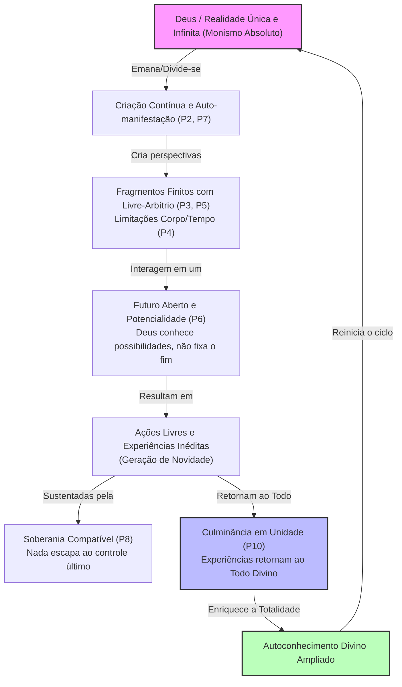
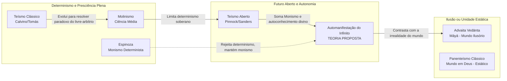

# Diagramas da Teoria da Automanifestação do Infinito

## 1. O Ciclo da Automanifestação Experiencial

```mermaid
graph TD
    Infinito["Deus / Realidade Única e Infinita (Monismo Absoluto)"]
    Criacao["Criação Contínua e Auto-manifestação (P2, P7)"]
    Fragmentos["Fragmentos Finitos com Livre-Arbítrio (P3, P5)<br>Limitações Corpo/Tempo (P4)"]
    FuturoAberto["Futuro Aberto e Potencialidade (P6)<br>Deus conhece possibilidades, não fixa o fim"]
    Acoes["Ações Livres e Experiências Inéditas<br>(Geração de Novidade)"]
    Soberania["Soberania Compatível (P8)<br>Nada escapa ao controle último"]
    Retorno["Culminância em Unidade (P10)<br>Experiências retornam ao Todo Divino"]
    Autoconhecimento["Autoconhecimento Divino Ampliado"]

    Infinito -->|Emana/Divide-se| Criacao
    Criacao -->|Cria perspectivas| Fragmentos
    Fragmentos -->|Interagem em um| FuturoAberto
    FuturoAberto -->|Resultam em| Acoes
    Acoes -->|Sustentadas pela| Soberania
    Acoes -->|Retornam ao Todo| Retorno
    Retorno -->|Enriquece a Totalidade| Autoconhecimento
    Autoconhecimento -->|Reinicia o ciclo| Infinito
    
    style Infinito fill:#f9f,stroke:#333,stroke-width:2px
    style Retorno fill:#bbf,stroke:#333,stroke-width:2px
    style Autoconhecimento fill:#bfb,stroke:#333,stroke-width:2px
```

## 2. Espectro Teológico da Onisciência e Livre-Arbítrio

```mermaid
graph LR
    subgraph Determinismo e Presciência Plena
        A[Teísmo Clássico<br>Calvino/Tomás]
        B[Molinismo<br>Ciência Média]
        C[Espinoza<br>Monismo Determinista]
    end

    subgraph Futuro Aberto e Autonomia
        D[Teísmo Aberto<br>Pinnock/Sanders]
        E[Automanifestação do Infinito<br>TEORIA PROPOSTA]
    end

    subgraph Ilusão ou Unidade Estática
        F[Advaita Vedānta<br>Māyā - Mundo Ilusório]
        G[Panenteísmo Clássico<br>Mundo em Deus - Estático]
    end

    A -->|Evolui para resolver paradoxo do livre-arbítrio| B
    B -->|Limita determinismo soberano| D
    D -->|Soma Monismo e autoconhecimento divino| E
    E -->|Contrasta com a irrealidade do mundo| F
    C -.->|Rejeita determinismo, mantém monismo| E
```
